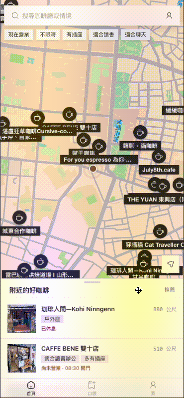
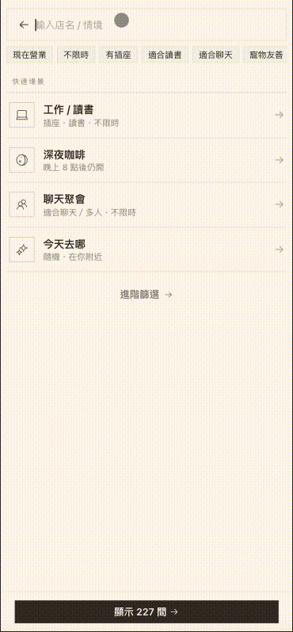
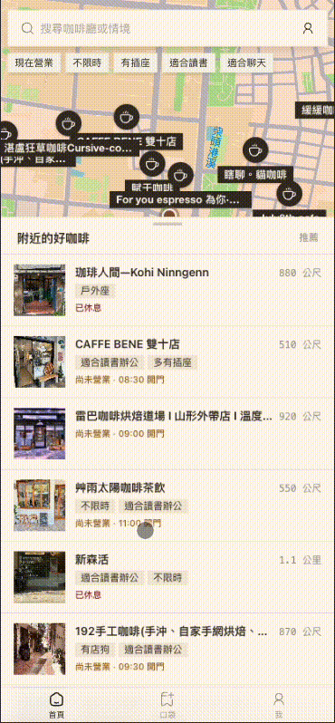
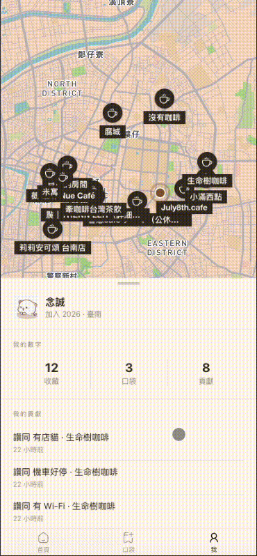

# ☕ Coffee Pocket — 咖啡口袋

> 快速找到符合情境的店，並收藏你的口袋名單！

Coffee Pocket 是一款以**臺南咖啡廳**為主題的探索與收藏工具，幫助使用者依據「有沒有插座」「適不適合讀書」「有沒有限時」等實用標籤，快速找到符合需求的咖啡廳，並將喜歡的店家加入個人口袋名單。

支援桌面與行動裝置，也可安裝為 PWA 使用。

---


### 桌面版畫面

https://github.com/user-attachments/assets/4aa4aaee-2f07-4673-b38c-2380afb39b81

### 手機版畫面

| 首頁 | 搜尋結果 | 標籤篩選 | 口袋名單 |
|:---:|:---:|:---:|:---:|
|  |  |  |  |

---

## 專案初衷

在臺南找一間「有插座、不限時、適合工作」的咖啡廳，往往要翻很多評論才能確認。Coffee Pocket 的目標是把這些散落在各處的資訊結構化 —— 從多個來源抓取並彙整咖啡廳資料，透過 LLM 將使用者評論萃取為語意標籤，最終呈現在一個簡潔好用的介面上，讓找店不再需要反覆爬文。

---

## 技術架構

```
┌────────────────────────────────────────────────────────┐
│                      Frontend (PWA)                    │
│   React · TypeScript · Vite · Tailwind / daisyUI       │
│   Mapbox GL · React Query · React Router · Vaul        │
├────────────────────────────────────────────────────────┤
│                      Backend / BaaS                    │
│   Supabase (PostgreSQL + PostGIS + Auth + Edge Func.)  │
│   FastAPI (新增咖啡廳 pipeline)                         │
├────────────────────────────────────────────────────────┤
│                  Data Pipeline (Python)                 │
│   資料抓取 · Places API · LLM 語意萃取 · Semantic Layer │
├────────────────────────────────────────────────────────┤
│                      Deployment                        │
│   Firebase Hosting (前端)  ·  Fly.io (API 服務)         │
│   Cloudflare R2 (圖片儲存)                              │
└────────────────────────────────────────────────────────┘
```

### 使用技術一覽

| 層級 | 技術 |
| --- | --- |
| **前端** | React 18, TypeScript, Vite, Tailwind CSS, daisyUI, Mapbox GL JS |
| **UI 元件** | Hugeicons (icon), Vaul (mobile drawer), pinyin-pro (搜尋拼音匹配) |
| **後端 / 資料庫** | Supabase (PostgreSQL + PostGIS + Auth), Edge Functions (Deno) |
| **API 服務** | FastAPI, Uvicorn |
| **資料處理** | Python 3.11+, Playwright (自動化), httpx, Pydantic |
| **LLM 萃取** | OpenRouter / OpenAI API |
| **部署** | Firebase Hosting (SPA), Fly.io (FastAPI), Cloudflare R2 (圖片) |
| **套件管理** | npm (前端), uv (Python) |

---

## 頁面功能說明

### 首頁（搜尋與地圖）

首頁是整個應用的核心入口，結合**地圖**與**列表**兩種瀏覽方式：

- **自然語言搜尋**：在搜尋欄輸入如「有插座適合工作的咖啡廳」，系統會透過 Edge Function 解析語意並轉換為標籤篩選條件。
- **標籤篩選**：直接點選標籤（插座、不限時、適合讀書⋯）快速過濾，支援 AND / OR 組合。
- **情境推薦**：提供「讀書 K 書」「朋友聚會」等快速情境按鈕，一鍵套用對應標籤組合。
- **地圖互動**：Mapbox 地圖標示所有符合條件的咖啡廳位置，點擊 marker 可直接檢視詳細資訊。
- **距離與營業時間**：可依使用者位置排序，也能篩選「現在有營業」的店家。
- **口袋名單**：登入後可將喜歡的咖啡廳加入個人口袋名單，隨時回顧。

行動版採用 Apple Maps 風格的底部 sheet 介面，桌面版則是左側列表 + 中間詳細欄 + 右側地圖的三欄佈局。

### 咖啡廳詳細資訊

點選任何一間咖啡廳後，可以看到：

- **基本資訊**：店名、地址、Google Maps 連結、評分。
- **營業時間**：依星期顯示每日營業時段。
- **語意標籤**：由評論萃取而來的結構化標籤，每個標籤附帶信心分數與證據來源數量，例如「插座多 — 12 則評論提及」。
- **封面照片**：店家的代表圖片。
- **社群互動**：登入使用者可以對標籤進行投票（贊同 / 不贊同），協助校正資訊正確性。
- **收藏操作**：加入或移除口袋名單。

---

## 快速開始

### 前置需求

- **Node.js** ≥ 18
- **Python** ≥ 3.11 + [uv](https://docs.astral.sh/uv/)（僅資料處理 pipeline 需要）
- **Supabase** 專案（含 PostgreSQL + PostGIS）
- **Mapbox** Token（地圖功能）

### 1. Clone 專案

```bash
git clone https://github.com/ncchen99/Coffee-Pocket.git
cd Coffee-Pocket
```

### 2. 啟動前端

```bash
cd web
npm install
cp .env.example .env
# 填入 Supabase 與 Mapbox 金鑰
npm run dev
```

前端所需的環境變數（`web/.env`）：

```bash
VITE_SUPABASE_URL=          # Supabase 專案 URL
VITE_SUPABASE_ANON_KEY=     # Supabase anon key
VITE_MAPBOX_TOKEN=           # Mapbox access token
VITE_ADD_CAFE_API_BASE=http://localhost:8000  # 新增咖啡廳 API
```

> 沒有 `VITE_MAPBOX_TOKEN` 時，地圖頁會 fallback 成純清單模式，不會崩潰。

### 3. 啟動後端 API（選用）

如需「新增咖啡廳」功能，需另外啟動 FastAPI 服務：

```bash
# 回到專案根目錄
cp .env.example .env
# 填入 Supabase、Google Places API Key 等
uv sync
uv run uvicorn services.api.main:app --reload --port 8000
```

### 4. 資料庫

資料庫 schema 與 migration 檔案位於 `supabase/` 資料夾，使用 Supabase CLI 管理：

```bash
npx supabase db push
```

---

## 專案結構

```
Coffee-Pocket/
├── web/                  # 前端 (React + Vite + Tailwind)
│   ├── src/
│   │   ├── components/   # UI 元件 (cafe, search, layout, primitives)
│   │   ├── pages/        # 頁面 (MapPage, LoginPage, SettingsPage …)
│   │   ├── hooks/        # React hooks
│   │   ├── lib/          # 工具函式 (API, filter, format)
│   │   ├── context/      # React Context (user location …)
│   │   └── types/        # TypeScript 型別定義
│   └── public/           # 靜態資源 (favicon, manifest)
├── services/api/         # FastAPI 後端服務 (新增咖啡廳 pipeline)
├── supabase/             # Supabase config, migrations, edge functions
│   └── functions/        # Edge Functions (smart-search, parse-prompt …)
├── src/                  # Python 資料處理 pipeline
│   └── coffee_pocket/
│       └── agents/       # 資料抓取、清理、LLM 萃取、語意彙整
├── specs/                # 標籤定義 (semantic_layer.yaml) 與需求文件
├── docs/                 # 文件
└── data/                 # 本地資料快取 (reviews, ig posts …)
```

---

## 資料處理

咖啡廳資料從多個來源匯入（Cafe Nomad、Google 地圖清單、Instagram 貼文、使用者手動新增等），經過 Place ID 比對、去重、LLM 語意萃取等步驟，最終產出結構化的標籤資料。

我們透過 Google Places API 取得店家基本資訊，並從公開來源蒐集評論進行語意分析。這些評論並不會直接顯示在平台上，而是經過 LLM 萃取後轉化為結構化標籤（如「有插座」「適合讀書」），屬於合理使用範圍。

> 📖 資料處理 pipeline 的詳細操作步驟請參閱 [docs/data-pipeline.md](docs/data-pipeline.md)。

---

## License

[MIT](LICENSE) © 念誠
